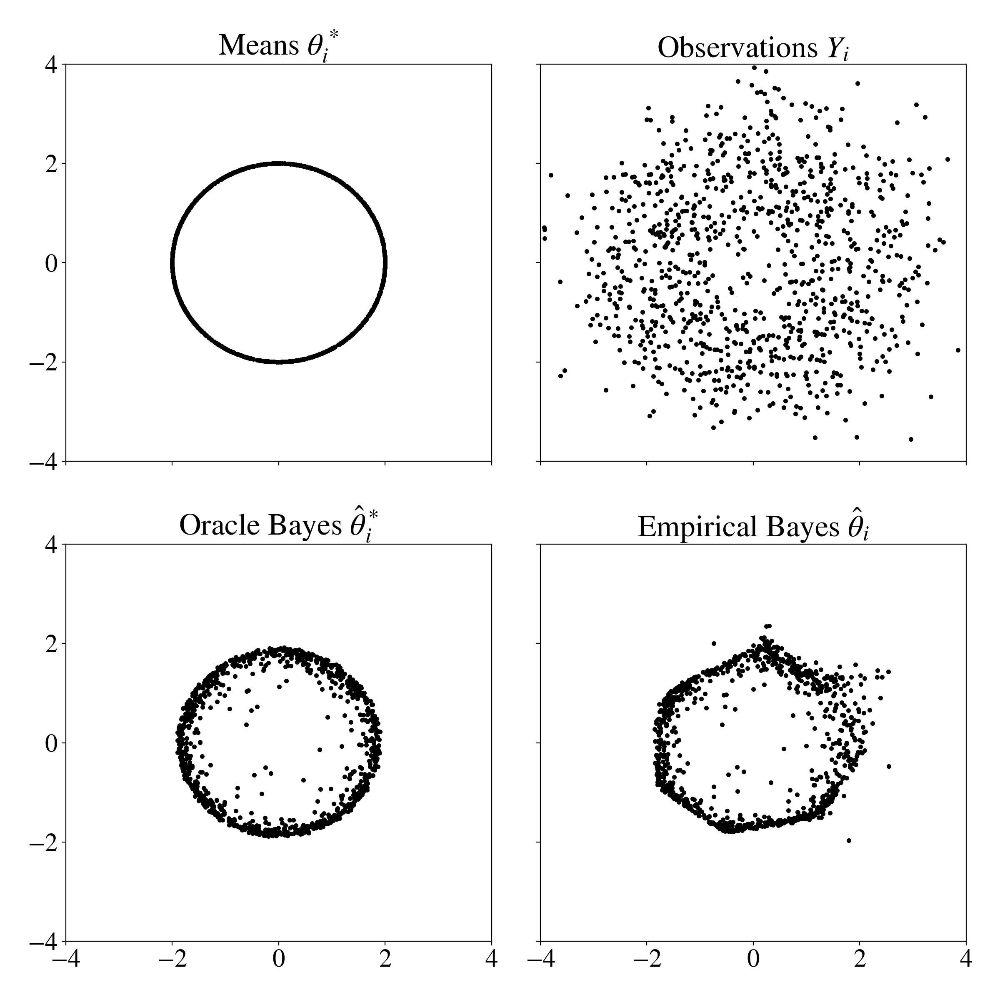

# npeb: Nonparametric Empirical Bayes in Python

Nonparametric Maximum Likelihood Estimator (NPMLE) for estimating Gaussian location mixture densities in d-dimensions from independent, potentially heteroscedastic observations. 

Basic usage:
<pre><code>from npeb.GLMixture import *

m = GLMixture()

## Compute the NPMLE 
m.fit(X, prec)

## Denoised estimates based on empirical prior
gmleb = m.posterior_mean(X, prec) 
</code></pre>

